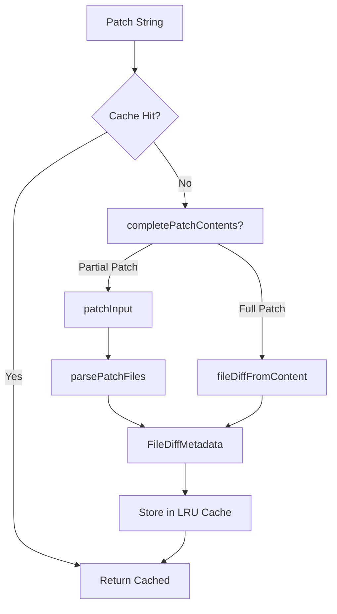

# OpenCode Diff Viewer — Complete Technical Documentation

> **Version:** 1.17.16  
> **Framework:** SolidJS (fine-grained reactive UI)  
> **Diff Engine:** `@pierre/diffs` + `diff` (jsdiff)  
> **Syntax Highlighting:** Shiki (`@shikijs/stream`, `@shikijs/transformers`)  
> **Last Updated:** July 2026

---

## Table of Contents

1. [Architecture Overview](#1-architecture-overview)
2. [Diff Data Pipeline](#2-diff-data-pipeline)
   - [2.1 Data Sources](#21-data-sources)
   - [2.2 Parsing Layer](#22-parsing-layer)
   - [2.3 Normalization Layer](#23-normalization-layer)
   - [2.4 Caching Layer](#24-caching-layer)
3. [Core Types & Schemas](#3-core-types--schemas)
4. [Component Tree & UI Architecture](#4-component-tree--ui-architecture)
   - [4.1 Component Hierarchy](#41-component-hierarchy)
   - [4.2 SessionReviewV2 (Main Container)](#42-sessionreviewv2-main-container)
   - [4.3 ReviewPanelV2 (Integration Layer)](#43-reviewpanelv2-integration-layer)
   - [4.4 SessionReviewFilePreviewV2 (Diff View)](#44-sessionreviewfilepreviewv2-diff-view)
   - [4.5 DiffChanges (Stats Widget)](#45-diffchanges-stats-widget)
   - [4.6 File Tree & Sidebar](#46-file-tree--sidebar)
5. [Diff Rendering Engine](#5-diff-rendering-engine)
   - [5.1 Unified vs Split View](#51-unified-vs-split-view)
   - [5.2 Hunk Management](#52-hunk-management)
   - [5.3 Line-by-Line Diff Algorithm](#53-line-by-line-diff-algorithm)
   - [5.4 Syntax Highlighting Process](#54-syntax-highlighting-process)
6. [Line Comments System](#6-line-comments-system)
7. [State Management](#7-state-management)
8. [Performance Optimization](#8-performance-optimization)
9. [Dependencies (Complete)](#9-dependencies-complete)
10. [Color System & Theming](#10-color-system--theming)
11. [Keyboard Navigation & Accessibility](#11-keyboard-navigation--accessibility)
12. [Error Handling & Edge Cases](#12-error-handling--edge-cases)
13. [Event Flow Diagram](#13-event-flow-diagram)
14. [Integration Points](#14-integration-points)
15. [File-by-File Source Map](#15-file-by-file-source-map)

---

## 1. Architecture Overview

The OpenCode Diff Viewer is a **multi-layered reactive system** designed for high-performance code review. It processes file diffs from multiple sources (Git VCS, AI snapshots, legacy formats), parses them into a normalized internal representation, renders them with full syntax highlighting, and provides interactive features like line comments, file navigation, and view mode switching.

```
┌─────────────────────────────────────────────────────────────────────────┐
│                          DATA SOURCES                                    │
│                                                                          │
│   ┌──────────────┐    ┌──────────────┐    ┌──────────────┐              │
│   │  Git VCS      │    │  Snapshot    │    │   Legacy     │              │
│   │  (git diff)   │    │  (Tool/Agent)│    │  (Old SDK)   │              │
│   └──────┬───────┘    └──────┬───────┘    └──────┬───────┘              │
│          │                  │                    │                        │
│          ▼                  ▼                    ▼                        │
│   ┌─────────────────────────────────────────────────────┐                │
│   │               PARSING LAYER                          │                │
│   │   ┌─────────────┐  ┌───────────────┐                │                │
│   │   │ parsePatch() │  │parseDiffFromFile│               │                │
│   │   │  (jsdiff)    │  │ (@pierre/diffs)│               │                │
│   │   └─────────────┘  └───────────────┘                │                │
│   └──────────────────────┬──────────────────────────────┘                │
│                          │                                                │
│                          ▼                                                │
│   ┌─────────────────────────────────────────────────────┐                │
│   │           NORMALIZATION LAYER                        │                │
│   │   normalize() → ViewDiff { file, additions,          │                │
│   │     deletions, status, fileDiff }                    │                │
│   └──────────────────────┬──────────────────────────────┘                │
│                          │                                                │
│                          ▼                                                │
│   ┌─────────────────────────────────────────────────────┐                │
│   │              UI RENDERING LAYER                      │                │
│   │                                                      │                │
│   │  ┌──────────────────────────────────────────────┐   │                │
│   │  │         SessionReviewV2 (Main Container)      │   │                │
│   │  │  ┌──────────┐  ┌──────────────────────────┐  │   │                │
│   │  │  │ Sidebar  │  │     Preview Panel        │  │   │                │
│   │  │  │ FileTree │  │  ┌────────────────────┐  │  │   │                │
│   │  │  │ Filter   │  │  │ FilePreviewV2     │  │  │   │                │
│   │  │  │ Stats    │  │  │ ┌──────────────┐  │  │  │   │                │
│   │  │  └──────────┘  │  │ │ DiffChanges  │  │  │  │   │                │
│   │  │                │  │ │ (Shiki HL)   │  │  │  │   │                │
│   │  │                │  │ └──────────────┘  │  │  │   │                │
│   │  │                │  │ ┌──────────────┐  │  │  │   │                │
│   │  │                │  │ │ LineComments │  │  │  │   │                │
│   │  │                │  │ └──────────────┘  │  │  │   │                │
│   │  │                │  └────────────────────┘  │  │   │                │
│   │  │                └──────────────────────────┘  │   │                │
│   │  └──────────────────────────────────────────────┘   │                │
│   └─────────────────────────────────────────────────────┘                │
└─────────────────────────────────────────────────────────────────────────┘
```

### Key Design Principles

1. **Reactive First:** Built on SolidJS — fine-grained signals and memos, no virtual DOM. Every computed value is a `createMemo()` that auto-updates when dependencies change.
2. **Immutable Data Flow:** Diffs flow through the pipeline as immutable objects. The UI subscribes to changes and reactively re-renders only the affected parts.
3. **Lazy Evaluation:** Large diffs (>500 lines) are not fully rendered until needed. Virtual scrolling ensures only visible lines are in the DOM.
4. **Cache-Heavy:** Parsing results are cached (LRU, max 16 entries) to avoid re-parsing identical patches on re-render.
5. **Composable UI:** Built from shared `@opencode-ai/ui` components (Accordion, Button, DropdownMenu, RadioGroup, etc.) for consistency.

---

## 2. Diff Data Pipeline

### 2.1 Data Sources

The diff viewer accepts diffs from three distinct sources, each with its own data shape:

#### A. VCS (Git) File Diffs

Generated by `git diff` operations. Always contain a full unified-diff `patch` string.

```typescript
interface VcsFileDiff {
  file: string              // File path (e.g., "src/components/button.tsx")
  patch: string             // Full git diff output
  additions: number         // Count of added lines
  deletions: number         // Count of deleted lines
  status: "added" | "deleted" | "modified"
}
```

**Patch format example:**
```
diff --git a/src/file.ts b/src/file.ts
index abc123..def456 100644
--- a/src/file.ts
+++ b/src/file.ts
@@ -10,7 +10,7 @@
  context line
-removed line
+added line
  context line
```

#### B. Snapshot File Diffs

Generated by AI agent tool calls. May contain `patch` (pre-computed), or raw `before`/`after` content strings for the parser to diff.

```typescript
interface SnapshotFileDiff {
  file: string              // File path
  patch?: string            // Optional pre-computed patch
  before?: string           // Original file content
  after?: string            // Modified file content
  additions: number
  deletions: number
  status: "added" | "deleted" | "modified"
}
```

#### C. Legacy Diffs (Backward Compatibility)

Older format that bundles all fields.

```typescript
type LegacyDiff = {
  file: string
  patch?: string
  before?: string
  after?: string
  additions: number
  deletions: number
  status?: "added" | "deleted" | "modified"
}
```

### 2.2 Parsing Layer

Located in `session-ui/src/components/session-diff.ts`. This is the core parsing logic.

#### `resolveFileDiff(diff: DiffSource): FileDiffMetadata`

The entry point for diff resolution. It routes to the correct parser based on available data:

```typescript
export function resolveFileDiff(diff: DiffSource) {
  if (typeof diff.patch === "string")
    return fileDiffFromPatch(diff.file, diff.patch)
  return fileDiffFromContent(
    diff.file,
    typeof diff.before === "string" ? diff.before : "",
    typeof diff.after === "string" ? diff.after : "",
  )
}
```

#### `fileDiffFromPatch(file: string, patch: string): FileDiffMetadata`

Parses a unified diff patch string into structured diff data.



#### `completePatchContents(patch: string)`

An optimization that reconstructs full file content from a single-hunk patch. This avoids re-running the full diff algorithm when the patch already contains the complete picture.

**Algorithm:**
1. Parse the patch with `parsePatch()` from `diff` library
2. Verify it has a valid index/header (starts with `diff --git` or has full `---/+++` with tabs)
3. Check it's a single hunk starting at line 1
4. Walk each line: collect `-` and ` ` lines into `before`, `+` and ` ` lines into `after`
5. Handle `\ No newline at end of file` markers
6. Return `{ before, after }` strings

```typescript
function completePatchContents(patch: string) {
  const parsed = parsePatch(patch)[0]
  if (!parsed || !parsed.index && !parsed.oldFileName && !parsed.newFileName) return
  if (!patch.startsWith("diff --git ") && !/^--- [^\n]*\t\r?\n\+\+\+ [^\n]*\t(?:\r?\n|$)/m.test(patch)) return
  if (parsed.hunks.length !== 1) return
  // ... line-by-line reconstruction
  return { before: text(before), after: text(after) }
}
```

#### `patchInput(file: string, patch: string)`

Wraps partial patches with proper headers so `@pierre/diffs` can parse them correctly:

```typescript
function patchInput(file: string, patch: string) {
  const parsed = parsePatch(patch)[0]
  if (!parsed) return
  if (parsed.index || parsed.oldFileName || parsed.newFileName) return patch
  if (!parsed.hunks.length) return
  return `Index: ${file}\n===================================================================\n--- ${file}\t\n+++ ${file}\t\n${patch}`
}
```

#### `fileDiffFromContent(file: string, before: string, after: string): FileDiffMetadata`

Delegates to `@pierre/diffs`'s `parseDiffFromFile()` for full content comparison:

```typescript
function fileDiffFromContent(file: string, before: string, after: string) {
  if (!before && !after) return emptyFileDiff(file)
  return parseDiffFromFile(
    { name: file, contents: before },
    { name: file, contents: after }
  )
}
```

### 2.3 Normalization Layer

Converts all diff variants into a unified `ViewDiff` structure:

```typescript
export type ViewDiff = {
  file: string
  additions: number
  deletions: number
  status?: "added" | "deleted" | "modified"
  fileDiff: FileDiffMetadata
}

export function normalize(diff: ReviewDiff): ViewDiff {
  return {
    file: diff.file,
    additions: diff.additions,
    deletions: diff.deletions,
    status: diff.status,
    fileDiff: resolveFileDiff(diff),
  }
}
```

The `FileDiffMetadata` from `@pierre/diffs` contains:
```typescript
interface FileDiffMetadata {
  deletionLines: string[]       // All lines in the "before" version
  additionLines: string[]       // All lines in the "after" version
  // Internal hunk structure, line annotations, etc.
}
```

### 2.4 Caching Layer

A **Least Recently Used (LRU) cache** stores parsed `FileDiffMetadata` results to avoid redundant computation:

```typescript
const diffCacheLimit = 16
const patchFileDiffCache = new Map<string, FileDiffMetadata>()

// Cache key: `${file}\0${patch}`
// LRU eviction: delete oldest entry when cache exceeds limit
function fileDiffFromPatch(file: string, patch: string) {
  const key = `${file}\0${patch}`
  const hit = patchFileDiffCache.get(key)
  if (hit) {
    // Move to end (most recently used)
    patchFileDiffCache.delete(key)
    patchFileDiffCache.set(key, hit)
    return hit
  }
  // ... compute and cache
  patchFileDiffCache.set(key, value)
  while (patchFileDiffCache.size > diffCacheLimit)
    patchFileDiffCache.delete(patchFileDiffCache.keys().next().value!)
  return value
}
```

---

## 3. Core Types & Schemas

### Data Model (`schema/src/file-diff.ts`)

```typescript
import { Schema } from "effect"

export const Info = Schema.Struct({
  file: Schema.optional(Schema.String),              // File path (optional for backward compat)
  patch: Schema.optional(Schema.String),              // Unified diff patch
  additions: Schema.Finite,                            // Number of added lines
  deletions: Schema.Finite,                            // Number of deleted lines
  status: Schema.optional(                            // File change type
    Schema.Literals(["added", "deleted", "modified"])
  ),
}).annotate({ identifier: "SnapshotFileDiff" })

export interface Info extends Schema.Schema.Type<typeof Info> {}
```

### Internal Diff Types (`session-ui/src/components/session-diff.ts`)

```typescript
// Unified diff source after normalization
export type DiffSource = Pick<LegacyDiff, "file" | "patch" | "before" | "after">

// Normalized view-ready diff
export type ViewDiff = {
  file: string
  additions: number
  deletions: number
  status?: "added" | "deleted" | "modified"
  fileDiff: FileDiffMetadata      // From @pierre/diffs
}

// Unified review diff type
type ReviewDiff = SnapshotDiff | VcsFileDiff | LegacyDiff
```

### Type Guards

```typescript
// session-ui/src/components/session-review.tsx
function diff(value: unknown): value is ReviewDiff {
  if (!value || typeof value !== "object" || Array.isArray(value)) return false
  if (!("file" in value) || typeof value.file !== "string") return false
  if (!("additions" in value) || typeof value.additions !== "number") return false
  if (!("deletions" in value) || typeof value.deletions !== "number") return false
  if ("patch" in value && value.patch !== undefined && typeof value.patch !== "string") return false
  if ("before" in value && value.before !== undefined && typeof value.before !== "string") return false
  if ("after" in value && value.after !== undefined && typeof value.after !== "string") return false
  if (!("status" in value) || value.status === undefined) return true
  return value.status === "added" || value.status === "deleted" || value.status === "modified"
}
```

### Comment Types

```typescript
// Line selection range
interface SelectedLineRange {
  startLine: number
  endLine: number
  side: "left" | "right" | "both"
}

// Comment data
interface SessionReviewLineComment {
  file: string
  selection: SelectedLineRange
  comment: string
  preview?: string
}

// Comment with ID (for updates)
interface SessionReviewCommentUpdate extends SessionReviewLineComment {
  id: string
}

// Comment deletion
interface SessionReviewCommentDelete {
  id: string
  file: string
}

// Comment focus
interface SessionReviewFocus {
  file: string
  id: string
}
```

### Diff Kind Classification (`review-diff-kinds.ts`)

```typescript
export type Kind = "add" | "del" | "mix"

// Classify each file/directory by its change kind
export function reviewDiffKinds(diffs: RenderDiff[]): Map<string, Kind> {
  const out = new Map<string, Kind>()
  for (const diff of diffs) {
    const file = normalizePath(diff.file)
    const kind = diff.status === "added" ? "add"
               : diff.status === "deleted" ? "del"
               : "mix"
    out.set(file, kind)

    // Propagate kind to parent directories (merge logic)
    const parts = file.split("/")
    parts.slice(0, -1).forEach((_, idx) => {
      const dir = parts.slice(0, idx + 1).join("/")
      if (!dir) return
      out.set(dir, merge(out.get(dir), kind))
    })
  }
  return out
}
```

---

## 4. Component Tree & UI Architecture

### 4.1 Complete Component Hierarchy

```
<SessionReviewV2>                    (Main container — split layout)
  ├── Header
  │   ├── Title                      ("Review Changes")
  │   ├── RadioGroup                 (Unified / Split mode switcher)
  │   └── DiffChanges                (+N -M stats badge)
  │
  ├── Sidebar (collapsible, 240-400px)
  │   ├── SidebarToggle
  │   ├── FileFilterInput            (Search by filename)
  │   ├── StatsHeader
  │   │   └── DiffChanges
  │   │       └── BarSVG             (5-bar mini visualization)
  │   └── FileTreeV2                 (Hierarchical file tree)
  │       ├── FileTreeNode
  │       │   ├── FileIcon           (Language-aware icon)
  │       │   ├── Filename
  │       │   ├── StatusIndicator    (add/del/modify color)
  │       │   └── DiffChanges        (per-file +N -M)
  │       └── ...
  │
  └── Preview Panel
      └── <SessionReviewFilePreviewV2>
          ├── FileHeader
          │   ├── FilePath
          │   ├── DiffStats          (per-file +N -M)
          │   ├── ViewFileButton     (Open in editor)
          │   └── FileActionsMenu    (Dropdown)
          │
          ├── StickyAccordionHeader  (scroll-aware sticky header)
          └── DiffContent
              ├── DiffHunk
              │   ├── HunkHeader     (@@ -N,M +N,M @@)
              │   └── DiffLine[]
              │       ├── LineNumber (clickable for comment)
              │       ├── CodeContent (syntax highlighted)
              │       └── LineAnnotation (comment indicator)
              │
              ├── LargeDiffWarning   (>500 lines)
              │   ├── Title
              │   ├── MetaInfo       ("+X -Y lines changed")
              │   └── ActionButtons  (View anyway, Open file)
              │
              ├── LineCommentPopover
              │   ├── CommentEditor
              │   ├── MentionDropdown
              │   └── ActionButtons  (Save/Cancel/Edit/Delete)
              │
              └── EmptyState ("No changes")
```

### 4.2 SessionReviewV2 (Main Container)

**File:** `session-ui/src/v2/components/session-review-v2.tsx`

This is the top-level layout component that provides the split-panel structure.

```typescript
interface SessionReviewV2Props {
  title?: JSX.Element                      // Header title
  stats?: JSX.Element                      // DiffChanges component
  empty?: JSX.Element                      // Empty state component
  sidebarOpen: boolean                     // Sidebar visibility
  sidebarToggle: JSX.Element              // Toggle button
  sidebar: JSX.Element                    // Sidebar content
  preview: JSX.Element                    // Preview panel content
  activeFile?: string                     // Currently selected file
  files: string[]                         // All file paths
  onSelectFile: (file: string) => void    // File selection handler
  diffStyle: SessionReviewDiffStyle       // "unified" | "split"
  onDiffStyleChange?: (style: SessionReviewDiffStyle) => void
  expandMode: "all" | "collapsed" | "changed"
  onExpandModeChange: (mode: string) => void
  hasDiffs: boolean
}
```

**Layout structure:**
```css
[data-component="session-review-v2"] {
  display: flex;
  flex-direction: column;
  height: 100%;

  [data-slot="session-review-v2-header"] { /* 40px fixed height */ }
  [data-slot="session-review-v2-body"] {
    display: flex;
    flex: 1;
    min-height: 0;           /* Important for flex overflow */
  }
  [data-slot="session-review-v2-sidebar"] {
    width: 240-400px;
    flex-shrink: 0;
    overflow-y: auto;
  }
  [data-slot="session-review-v2-preview"] {
    flex: 1;
    overflow: hidden;        /* Contains scrollable content */
  }
}
```

### 4.3 ReviewPanelV2 (Integration Layer)

**File:** `packages/app/src/pages/session/v2/review-panel-v2.tsx`

This is the **smart component** that connects data flow to UI. It manages:

```typescript
export function ReviewPanelV2(props: ReviewPanelV2Props) {
  const diffs = createMemo(() => props.diffs().filter(filterRenderableDiff))
  const filteredFiles = createMemo(() =>
    filterReviewFiles(diffs().map(d => d.file), props.state.filter())
  )
  const kinds = createMemo(() => reviewDiffKinds(diffs()))

  // Active file selection logic
  const activeDiff = createMemo(() => {
    const focus = props.focusedComment
    if (focus && diffs().some(d => d.file === focus.file))
      return focus.file
    const active = props.activeFile
    if (searching()) return active
    const files = filteredFiles()
    if (active && files.includes(active)) return active
    return files[0]    // Default: first file
  })

  // Lazy loading for large diffs
  const [loadedDiff] = createResource(detailSource, async ({ diff, load, version }) => {
    const value = await load(diff.file, version)
    if (value?.file !== diff.file) return
    return { source: diff, version, value }
  })

  return (
    <SessionReviewV2
      sidebar={<ReviewPanelV2Sidebar ... />}
      preview={<SessionReviewFilePreviewV2 ... />}
    />
  )
}
```

**Key logic flows:**

1. **File Filtering:** Real-time search across file paths
2. **Active File Selection:** Priority: focused comment → active prop → first filtered file
3. **Lazy Loading:** Diffs without patches (or empty) trigger async load
4. **Reactive Updates:** `createResource` for async diff loading with version tracking

### 4.4 SessionReviewFilePreviewV2 (Diff View)

**File:** `session-ui/src/v2/components/session-review-file-preview-v2.tsx`

This component renders the actual diff content for a single file.

```typescript
interface SessionReviewFilePreviewV2Props {
  file: string
  diff: ViewDiff
  content: FileContent | undefined
  diffStyle: SessionReviewDiffStyle
  readFile: (path: string) => Promise<FileContent | undefined>
  onOpenFile: (path: string) => void
  // ... line comment props
}
```

**Rendering flow:**

1. Check if diff is small enough to render directly (< 500 lines)
2. If large, show "Large Diff" warning with summary stats
3. For normal diffs, iterate through hunks and render each line
4. Apply syntax highlighting via Shiki
5. Attach line number gutter with comment triggers
6. Render line comment annotations

### 4.5 DiffChanges (Stats Widget)

**File:** `packages/ui/src/components/diff-changes.tsx`

Two variants of this component exist:

#### A. Default Variant (`data-variant="default"`)

Shows `+N -M` text:
```tsx
export function DiffChanges(props: { changes: ... }) {
  return (
    <Show when={total() > 0}>
      <div data-component="diff-changes">
        <span data-slot="diff-changes-additions">+{additions()}</span>
        <span data-slot="diff-changes-deletions">-{deletions()}</span>
      </div>
    </Show>
  )
}
```

Styled with:
```css
[data-slot="diff-changes-additions"] {
  color: var(--text-diff-add-base);    /* Green */
  font-family: var(--font-family-mono);
}
[data-slot="diff-changes-deletions"] {
  color: var(--text-diff-delete-base); /* Red */
  font-family: var(--font-family-mono);
}
```

#### B. Bars Variant (`data-variant="bars"`)

5-block SVG visualization showing change magnitude:

```
Algorithm:
1. Calculate total = additions + deletions
2. If total === 0 → 5 neutral blocks (gray)
3. If total < 5 → 1 colored block, rest neutral
4. Calculate ratio = max(adds, dels) / min(adds, dels)
5. Allocate 5 blocks by percentage:
   - Each block = color proportional to adds/dels ratio
   - At least 1 block for each non-zero value
6. Special rules for small changes:
   - adds ≤ 5 → max 1 green block
   - adds 5-10 → max 2 green blocks
   - Same for deletions
```

CSS for bars:
```css
[data-component="diff-changes"][data-variant="bars"] {
  width: 18px;
  height: 14px;
  svg { display: block; width: 100%; height: 100%; }
}
```

### 4.6 File Tree & Sidebar

**File:** `packages/app/src/components/file-tree-v2.tsx`

The sidebar file tree provides:

```
📁 src/                          [mix]  ██▓░░
  ┣ 📄 app.tsx                   [mod]  +5 -2
  ┣ 📁 components/
  ┃ ┣ 📄 button.tsx              [add]  +50
  ┃ ┗ 📄 card.tsx               [del]  -30
  ┣ 📄 utils.ts                  [mod]  +1 -1
```

**Features:**
- Hierarchical directory expansion
- Per-file change kind indicator (green/yellow/red dot)
- Mini diff bars per file
- Filter/search with real-time matching
- Keyboard navigation (arrow keys, enter)
- File count and total diff stats in header

---

## 5. Diff Rendering Engine

### 5.1 Unified vs Split View

#### Unified View (Default)

```
 @@ -10,7 +10,7 @@
  function example() {
    const x = 1
   -const y = 2
   +const y = 3
    return x + y
  }
```

- All changes in a single column
- Red background for deletions (line starts with `-`)
- Green background for additions (line starts with `+`)
- Gray for context lines (line starts with ` `)
- Line numbers on the left edge

#### Split View

```
 ┌─────────────┬─────────────┐
 │ 10 function │ 10 function │
 │ 11   const x│ 11   const x│
 │ 12  -const y│ 12          │
 │             │ 12  +const y│
 │ 13   return │ 13   return │
 └─────────────┴─────────────┘
```

- Original on the left, modified on the right
- Added lines shown only on the right (green)
- Deleted lines shown only on the left (red)
- Context lines shown on both sides (gray)
- Line numbers synchronized
- Visual alignment maintained with padding

### 5.2 Hunk Management

A **hunk** is a contiguous block of changes in a diff, delimited by the `@@` header:

```
@@ -start,count +start,count @@ optional-context
```

The parser extracts each hunk and its lines:

```typescript
interface Hunk {
  oldStart: number     // Starting line number in original
  oldLines: number     // Number of lines in original hunk
  newStart: number     // Starting line number in modified
  newLines: number     // Number of lines in modified hunk
  lines: HunkLine[]    // Individual lines
}

interface HunkLine {
  type: "added" | "deleted" | "context"
  content: string      // The actual line content (without +/- prefix)
  oldLineNum?: number  // Line number in original (context/deleted)
  newLineNum?: number  // Line number in modified (context/added)
}
```

**Hunk rendering logic:**
1. Parse `@@` header to get old/new start positions
2. Initialize line counters for both sides
3. For each line:
   - **Context (** `` **):** Increment both counters, show gray
   - **Deletion (-):** Increment old counter, show red
   - **Addition (+):** Increment new counter, show green
4. Continue until all hunks rendered
5. Insert appropriate spacing between hunks

### 5.3 Line-by-Line Diff Algorithm

The actual diff comparison (when only `before`/`after` strings are available) is handled by `@pierre/diffs`. This library uses a **Myers diff algorithm** variant:

```
Input:  beforeLines[], afterLines[]
Output: editScript[] (sequence of keep/insert/delete operations)

Algorithm:
1. Build edit graph: 2D grid where x = position in 'before', y = position in 'after'
2. Find shortest path from (0,0) to (N,M) using Myers' greedy algorithm
3. Trace back to produce edit operations
4. Group operations into hunks (contiguous regions)
5. Attach line numbers and generate unified diff format
```

The result contains:
```typescript
interface LineDiffResult {
  type: "equal" | "insert" | "delete" | "replace"
  value: string           // Line content
  oldLineNumber?: number  // Line number in original
  newLineNumber?: number  // Line number in modified
}
```

### 5.4 Syntax Highlighting Process

Syntax highlighting is powered by **Shiki** with streaming support:

```
1. Get file extension from path
2. Look up language grammar (TypeScript, Python, etc.)
3. Load Shiki highlighter with current theme tokens
4. For each line in the diff:
   a. Determine line type (context/deletion/addition)
   b. Apply base color from theme (--text-diff-add-base, etc.)
   c. Tokenize line content using Shiki grammar
   d. Apply language-specific token colors FROM WITHIN the line
   e. Wrap in appropriate HTML structure
5. Handle edge cases:
   - Empty files
   - Binary files (show warning)
   - Unknown languages (plain text highlighting)
```

**Shiki integration details:**

```typescript
import { createHighlighter } from "@shikijs/stream"
import { transformerNotationDiff } from "@shikijs/transformers"

// Highlighter is created once and reused
const highlighter = await createHighlighter({
  themes: ["github-dark", "github-light"],
  langs: ["typescript", "python", "javascript", ...]
})

// Apply diff-specific transformers
const html = highlighter.codeToHtml(code, {
  lang: "typescript",
  theme: "github-dark",
  transformers: [
    transformerNotationDiff(),  // Handles // [!code ++] and // [!code --]
  ]
})
```

---

## 6. Line Comments System

### Architecture

The line comment system is built around a **controller pattern**:

```typescript
function createLineCommentController<T extends LineCommentShape>(props: {
  // ... configuration
}): {
  note: {
    draft: () => T | null           // Current draft comment
    setDraft: (value: string) => void
    editing: () => T | null         // Comment being edited
    opened: Accessor<T | null>       // Currently open comment
    selected: Accessor<SelectedLineRange | null>
    commenting: Accessor<SelectedLineRange | null>
    isOpen: (id: string) => boolean
    isEditing: (id: string) => boolean
    closeComment: () => void
    openComment: (id: string, range, options?) => void
    toggleComment: (id: string, range, options?) => void
    openDraft: (range: SelectedLineRange) => void
    openEditor: (id, range, value) => void
    hoverComment: (range: SelectedLineRange) => void
    cancelDraft: () => void
    select: (range | null) => void
    reset: () => void
  }
  annotations: ...
  renderAnnotation: (annotation) => HTMLDivElement
  onLineSelected: (range | null) => void
}
```

### Comment Flow

```
User clicks line number gutter
  → Line number becomes highlighted
  → Comment popover appears at click position
  → User types comment text
  → Clicks "Save" button
  → onSubmit callback fires with SessionReviewLineComment
  → Comment appears as annotation on the diff
  → Parent component handles persistence
```

### Comment States

| State      | Visual                     | Behavior                            |
| ---------- | -------------------------- | ----------------------------------- |
| **Draft**      | Pencil icon, border        | Not saved, visible only to current user |
| **Saved**      | Comment bubble icon        | Persistent, visible to all           |
| **Editing**    | Text field with content    | Pre-filled with existing comment     |
| **Focused**    | Highlighted border + scroll | Programmatically scrolled into view  |
| **Hovered**    | Background change          | Tooltip with comment preview         |
| **Selected**   | Active highlight           | Line range selected                  |

---

## 7. State Management

### ReviewPanelV2State

```typescript
interface ReviewPanelV2State {
  sidebarOpened: () => boolean
  toggleSidebar: () => void
  filter: () => string
  setFilter: (value: string) => void
  expandMode: () => "all" | "collapsed" | "changed"
  setExpandMode: (mode: "all" | "collapsed" | "changed") => void
}
```

### Reactive Data Flow

```
props.diffs
    │
    ▼
createMemo(() => props.diffs().filter(filterRenderableDiff))
    │
    ▼ (filtered diffs)
    ├──► filterReviewFiles() → filteredFiles
    ├──► reviewDiffKinds() → kinds (Map<string, Kind>)
    └──► find() → activeDiff
              │
              ▼
         reviewDiffNeedsLoad()?
              │
         ┌────┴────┐
        Yes        No
         │          │
    createResource  │
    (async load)    │
         │          │
         ▼          ▼
    activeItem() — merged result
         │
         ▼
    SessionReviewFilePreviewV2
```

### Reactive Granularity

SolidJS ensures that only the specific DOM nodes that depend on changed data are updated:

- Changing `diffStyle` only re-renders the view mode switcher and diff container
- Changing `activeFile` only re-mounts the file preview (keyed on file path)
- Updating a line comment only affects that specific annotation element
- Filtering files only updates the file tree, not the preview
- Expanding/collapsing only affects the accordion state

---

## 8. Performance Optimization

### Optimization Techniques

| # | Technique | Implementation | Impact |
|---|-----------|---------------|--------|
| 1 | **LRU Cache** | Map with max 16 entries | Avoids re-parsing identical patches |
| 2 | **Virtual Scrolling** | Only render lines in viewport + 300px margin | DOM size proportional to viewport, not file size |
| 3 | **Lazy Loading** | Async `createResource` for large diffs | UI stays responsive during load |
| 4 | **Large Diff Threshold** | 500 lines → show warning instead of rendering | Prevents memory exhaustion |
| 5 | **Key-based Mounting** | File path as component key | Prevents unnecessary remounts on data refresh |
| 6 | **Memoization** | `createMemo` for all derived values | No redundant computation on re-render |
| 7 | **SSR Preloading** | `PreloadMultiFileDiffResult` | Server-sent diffs are ready before hydration |
| 8 | **CSS Containment** | `overflow: hidden` on preview | Isolates layout calculations |
| 9 | **Will-Change Optimizer** | `will-change: opacity` on view button | GPU-accelerated hover transitions |
| 10 | **Transform TranslateZ** | `translateZ(0)` on view button | Forces GPU compositing layer |

### Memory Management

```typescript
// LRU cache auto-eviction
const diffCacheLimit = 16
while (patchFileDiffCache.size > diffCacheLimit)
  patchFileDiffCache.delete(patchFileDiffCache.keys().next().value!)

// Large diff threshold
const MAX_DIFF_CHANGED_LINES = 500

// Virtual scroll margin
const REVIEW_MOUNT_MARGIN = 300  // pixels above/below viewport
```

### Bundle Size Optimization

The diff viewer is code-split and lazy-loaded:
- Main app bundle: does NOT include diff viewer code
- Diff viewer loads on-demand when user opens review tab
- Shiki grammars loaded per-language on first use

---

## 9. Dependencies (Complete)

### Production Dependencies

#### Diff Engine
```json
{
  "diff": "catalog:",                    // jsdiff — unified patch parsing
  "@pierre/diffs": "catalog:",          // Core diff engine, line comparison
  "@pierre/diffs/ssr": "catalog:"       // Server-side rendered diff preload
}
```

#### UI Framework
```json
{
  "solid-js": "latest",                 // Reactive UI framework
  "@solidjs/meta": "catalog:",          // Head meta management
  "@solidjs/router": "catalog:",        // Client-side navigation
  "@kobalte/core": "catalog:"           // Accessible UI primitives
}
```

#### SolidJS Primitives
```json
{
  "@solid-primitives/bounds": "0.1.3",          // Element bounds tracking
  "@solid-primitives/event-listener": "2.4.5",  // Event delegation
  "@solid-primitives/media": "2.3.3",           // Media query support
  "@solid-primitives/resize-observer": "2.1.3"  // Resize detection
}
```

#### Syntax Highlighting
```json
{
  "@shikijs/stream": "catalog:",        // Streaming syntax highlighter
  "@shikijs/transformers": "3.9.2"      // Diff transformers for Shiki
}
```

#### UI Component Library (`@opencode-ai/ui`)

```json
{
  "@opencode-ai/ui": "workspace:*",
  // Components used by diff viewer:
  // - Accordion        (file list expand/collapse)
  // - Button           (action buttons)
  // - DropdownMenu     (file actions menu)
  // - RadioGroup       (unified/split switcher)
  // - DiffChanges      (mini diff stats widget)
  // - FileIcon         (file type icons)
  // - Icon / IconButton  (UI icons)
  // - StickyAccordionHeader (sticky scroll headers)
  // - Tooltip          (hover hints)
  // - ScrollView       (virtual scrolling container)
}
```

#### Internal Workspace Packages
```json
{
  "@opencode-ai/core": "workspace:*",     // Core utilities (path, encode)
  "@opencode-ai/sdk": "workspace:*",     // Data types & API client
  "@opencode-ai/session-ui": "workspace:*", // Session UI components
  "@opencode-ai/app": "workspace:*"      // Main application
}
```

### Dev Dependencies
```json
{
  "typescript": "catalog:",
  "vite": "catalog:",
  "@playwright/test": "catalog:",        // E2E tests
  "@happy-dom/global-registrator": "20.0.11",  // Unit test DOM
  "@tailwindcss/vite": "catalog:",       // CSS utility framework
  "tw-animate-css": "1.4.0"              // Animation utilities
}
```

---

## 10. Color System & Theming

### CSS Custom Properties for Diff

The diff viewer uses CSS custom properties that change per theme. Here's how they map:

```css
/* Addition colors */
--text-diff-add-base: var(--v2-state-fg-success);
--icon-diff-add-base: var(--v2-state-fg-success);
--surface-success-base: var(--v2-state-bg-success);

/* Deletion colors */
--text-diff-delete-base: var(--v2-state-fg-danger);
--icon-diff-delete-base: var(--v2-state-fg-danger);
--surface-critical-base: var(--v2-state-bg-danger);

/* Modification (not standard, used in some contexts) */
--icon-diff-modified-base: var(--v2-state-fg-warning);

/* Neutral */
--icon-weak-base: #C7C7C7;        /* Placeholder for neutral diff bars */
```

### Theme-specific Values (example: OpenCode dark)

```css
/* Dark mode */
--text-diff-add-base: #b8db87;         /* Light green */
--text-diff-delete-base: #e26a75;      /* Rose */
--surface-success-base: #022B00;       /* Very dark green */
--surface-critical-base: #1F0603;      /* Very dark red */
--icon-diff-add-base: #b8db87;
--icon-diff-delete-base: #e26a75;
```

### V2 State Colors (used in OC-2 theme)

```css
/* For complete theme customization, these semantic tokens are used */
--v2-state-fg-success: var(--v2-green-800);     /* Light */  /* var(--v2-green-500) dark */
--v2-state-fg-danger: var(--v2-red-800);         /* Light */  /* var(--v2-red-500) dark */
--v2-state-bg-success: var(--v2-green-100);      /* Light */  /* var(--v2-green-1200) dark */
--v2-state-bg-danger: var(--v2-red-100);          /* Light */  /* var(--v2-red-1200) dark */
```

### Per-Theme Diff Colors (from themes.md)

| Theme        | Diff Add (Light) | Diff Delete (Light) | Diff Add (Dark) | Diff Delete (Dark) |
|-------------|-----------------|-------------------|-----------------|-------------------|
| AMOLED      | `#00e676`         | `#ff1744`           | `#00ff88`         | `#ff1744`           |
| Aura        | `#b3e6cc`         | `#f5b3b3`           | `#61ffca`         | `#ff6767`           |
| Ayu         | `#b1d780`         | `#e6656a`           | `#59c57c`         | `#f58572`           |
| Carbonfox   | `#198038`         | `#da1e28`           | `#42be65`         | `#ff8389`           |
| Catppuccin  | `#a6d189`         | `#e78284`           | `#94e2d5`         | `#f38ba8`           |
| Dracula     | `#9fe3b3`         | `#f8a1b8`           | `#2fb27d`         | `#ff6b81`           |
| GitHub      | —               | —                 | —               | —                 |
| Gruvbox     | `#79740e`         | `#9d0006`           | `#b8bb26`         | `#fb4934`           |
| Kanagawa    | `#89AF5B`         | `#D61F1F`           | `#A9D977`         | `#F24A4A`           |
| Matrix      | `#5dac7e`         | `#d53a3a`           | `#77ffaf`         | `#ff7171`           |
| Monokai     | `#bfe7a3`         | `#f6a3ae`           | `#4d7f2a`         | `#f4477c`           |
| Night Owl   | `#2aa298`         | `#de3d3b`           | `#c5e478`         | `#ef5350`           |
| Nord        | `#a3be8c`         | `#bf616a`           | `#81a1c1`         | `#bf616a`           |
| One Dark    | `#489447`         | `#d65145`           | `#aad482`         | `#e8828b`           |
| OpenCode    | `#4db380`         | `#f52a65`           | `#b8db87`         | `#e26a75`           |
| Osaka Jade  | —               | —                 | `#63b07a`         | `#db9f9c`           |
| Palenight   | —               | —                 | —               | —                 |
| Rose Pine   | —               | —                 | —               | —                 |
| Solarized   | `#c6dc7a`         | `#f2a1a1`           | `#4c7654`         | `#c34b4b`           |
| Synthwave84 | —               | —                 | `#97f1d8`         | `#ff5e5b`           |
| Tokyonight  | `#4f8f7b`         | `#d05f7c`           | `#41a6b5`         | `#c34043`           |
| Vercel      | `#46A758`         | `#E5484D`           | `#63C46D`         | `#FF6166`           |
| Vesper      | `#99FFE4`         | `#FF8080`           | `#99FFE4`         | `#FF8080`           |
| Zenburn     | —               | —                 | `#8fb28f`         | `#dca3a3`           |

---

## 11. Keyboard Navigation & Accessibility

### Keyboard Shortcuts

| Key              | Action                              |
| ---------------- | ----------------------------------- |
| `↑` / `↓`         | Navigate files in sidebar           |
| `Enter`           | Select file / expand accordion      |
| `Space`           | Toggle expand/collapse              |
| `Ctrl+F` / `Cmd+F` | Focus file filter input            |
| `Escape`          | Close comment / clear filter        |
| `Tab` / `Shift+Tab` | Cycle through interactive elements |

### ARIA Attributes

```html
<!-- Accordion (file list) -->
<div role="region" aria-label="Changed files">
  <button role="tab" aria-expanded="true" aria-controls="panel-1">
    <span>src/file.ts</span>
    <span aria-label="5 additions, 2 deletions">+5 -2</span>
  </button>
  <div role="tabpanel" id="panel-1">
    <!-- diff content -->
  </div>
</div>

<!-- Diff line -->
<div role="listitem" aria-label="Line 10: deleted: const oldValue = 1">
  <span role="presentation">10</span>
  <code>-const oldValue = 1</code>
</div>

<!-- Comment popover -->
<div role="dialog" aria-label="Add comment" aria-modal="true">
  <textarea aria-label="Comment text" ... />
  <button aria-label="Save comment">Save</button>
</div>
```

### Focus Management

- Comment popover traps focus
- Closing comment returns focus to the triggering line number
- File filter maintains focus during typing
- Sidebar toggle preserves scroll position

---

## 12. Error Handling & Edge Cases

### Error Scenarios

| Scenario | Handling |
|----------|----------|
| **Missing patch** | Triggers `reviewDiffNeedsLoad()` → async load via `createResource` |
| **Empty diff** | `emptyFileDiff()` returns empty `FileDiffMetadata`, UI shows "No changes" |
| **Both before/after empty** | Returns empty file diff immediately |
| **Invalid/malformed patch** | `try/catch` blocks in `parsePatch()`, returns empty diff |
| **Patch without header** | `patchInput()` wraps with synthetic header |
| **File not found** | `readFile()` catches error, returns `undefined` |
| **Large diff (>500 lines)** | Warning card with summary, user must click to view |
| **Binary files** | Handled upstream, shown as non-renderable |
| **New file (added)** | Status is "added", no "before" content |
| **Deleted file** | Status is "deleted", no "after" content |
| **Cache miss** | Computed fresh and added to cache |

### Error Recovery Flow

```
readFile(path) → 404 / permission denied
  → console.debug("[session-review-v2] failed to read file")
  → return undefined
  → UI shows placeholder / clear error message
```

### Guard Clauses

```typescript
// Ensure every diff has required fields
export function filterRenderableDiff(value: SnapshotFileDiff | VcsFileDiff): value is RenderDiff {
  return typeof value.file === "string"
}

// Skip empty diffs
export function reviewDiffNeedsLoad(diff: RenderDiff) {
  if (diff.additions === 0 && diff.deletions === 0) return false
  return !diff.patch || !/^@@ /m.test(diff.patch)
}
```

---

## 13. Event Flow Diagram

### File Selection Flow

```
User clicks file in sidebar
    │
    ▼
onSelectFile(filePath)
    │
    ▼
ReviewPanelV2
  → activeDiff updates (reactive)
  → sourceActiveItem updates
  → detailSource changes
    │
    ├── If diff needs load:
    │   → createResource fires
    │   → loadDiff(file, version) called
    │   → Response merged into activeItem
    │
    └── If diff ready:
        → activeItem returns immediately
    │
    ▼
SessionReviewFilePreviewV2 mounts (keyed on file path)
  → Renders diff content with Shiki highlighting
  → Updates line numbers
  → Restores comment annotations
```

### Comment Creation Flow

```
User hovers over line number
  → Gutter button appears (opacity transition)
  → User clicks line number
  → Line range selected (highlighted)
  → Comment popover opens at line position
  → User types comment
  → User clicks Save
  → onLineComment callback fires:
    { file, selection: {startLine, endLine, side}, comment }
  → Parent persists comment
  → Comment annotation appears in gutter
```

### Diff Style Change Flow

```
User clicks "Split" in RadioGroup
  → onDiffStyleChange("split") fires
  → Parent updates state
  → diffStyle prop changes reactively
  → SessionReviewFilePreviewV2 re-renders
  → Diff container switches layout from unified to split
  → Line numbers recalculated for both sides
  → All existing comments preserved (remapped to new positions)
```

---

## 14. Integration Points

### SDK Integration

```typescript
// Reading file content for diff preview
const readFile = async (path: string) =>
  sdk()
    .client.file.read({ path })
    .then((x) => x.data)
    .catch((error) => {
      console.debug("[session-review-v2] failed to read file", { path, error })
      return undefined
    })
```

### Editor Integration

```typescript
// Opening a file in the editor from diff view
onOpenFile={(path) => {
  // Navigate to file in editor tab
  navigate(`/workspace/file?path=${encodeURIComponent(path)}`)
}}
```

### Git Integration (VCS)

VCS diffs come from the Git service layer:
```typescript
// Git diff is fetched via the SDK's VCS endpoint
const gitDiffs = await sdk().vcs.diff({ base: "main", head: "feature" })
// Returns VcsFileDiff[]
```

### Snapshot Integration (AI Tool Results)

Tool execution results produce snapshot diffs:
```typescript
// After agent edits a file, the response includes:
const snapshotDiffs = toolResponse.diffs
// Returns SnapshotFileDiff[]
```

### E2E Test Integration

The diff viewer has comprehensive E2E tests:
```
e2e/regression/review-*.spec.ts:
  - review-line-comment.spec.ts
  - review-open-file.spec.ts
  - review-state-persistence.spec.ts
  - review-tab-switch.spec.ts
  - review-terminal-stacked.spec.ts
  - review-image-flash.spec.ts
```

---

## 15. File-by-File Source Map

| File | Package | Purpose |
|------|---------|---------|
| `schema/src/file-diff.ts` | `@opencode-ai/schema` | Diff data schema (Effect Schema) |
| `session-ui/src/components/session-diff.ts` | `@opencode-ai/session-ui` | Core diff parsing & normalization |
| `session-ui/src/components/session-review.tsx` | `@opencode-ai/session-ui` | Main review component (656 lines) |
| `session-ui/src/components/session-review.css` | `@opencode-ai/session-ui` | Review layout styles (247 lines) |
| `session-ui/src/components/session-diff.test.ts` | `@opencode-ai/session-ui` | Diff parser unit tests |
| `session-ui/src/pierre/diff-selection.ts` | `@opencode-ai/session-ui` | Line selection utilities |
| `session-ui/src/v2/components/session-review-v2.tsx` | `@opencode-ai/session-ui` | V2 review container |
| `session-ui/src/v2/components/session-review-file-preview-v2.tsx` | `@opencode-ai/session-ui` | Per-file diff preview |
| `session-ui/src/v2/components/session-review-empty-changes-v2.tsx` | `@opencode-ai/session-ui` | Empty state component |
| `session-ui/src/v2/components/session-review-empty-no-git-v2.tsx` | `@opencode-ai/session-ui` | No git repo state |
| `app/src/pages/session/v2/review-panel-v2.tsx` | `@opencode-ai/app` | Integration panel (255 lines) |
| `app/src/pages/session/v2/review-panel-v2-state.ts` | `@opencode-ai/app` | Panel state management |
| `app/src/pages/session/v2/review-diff-kinds.ts` | `@opencode-ai/app` | Diff kind classification |
| `app/src/pages/session/v2/review-diff-kinds.test.ts` | `@opencode-ai/app` | Kind classification tests |
| `app/src/utils/diffs.ts` | `@opencode-ai/app` | Diff utility functions |
| `app/src/utils/diffs.test.ts` | `@opencode-ai/app` | Diff utility tests |
| `ui/src/components/diff-changes.tsx` | `@opencode-ai/ui` | Diff changes widget |
| `ui/src/components/diff-changes.css` | `@opencode-ai/ui` | Diff changes styles |
| `ui/src/v2/components/diff-changes-v2.tsx` | `@opencode-ai/ui` | V2 diff changes widget |
| `ui/src/v2/components/diff-changes-v2.css` | `@opencode-ai/ui` | V2 diff changes styles |
| `session-ui/src/components/line-comment.tsx` | `@opencode-ai/session-ui` | Line comment component |
| `session-ui/src/components/line-comment-annotations.ts` | `@opencode-ai/session-ui` | Comment annotation controller |
| `session-ui/src/components/line-comment-styles.ts` | `@opencode-ai/session-ui` | Comment style utilities |
| `opencode/test/server/session-diff-missing-patch.test.ts` | `opencode` | Missing patch integration test |

---

## Appendix A: Glossary

| Term | Definition |
|------|------------|
| **Hunk** | A contiguous block of changes in a diff, delimited by `@@` headers |
| **Unified Diff** | Standard format showing both deletions and additions in a single view |
| **Split Diff** | Side-by-side view with original on left, modified on right |
| **Patch** | A string in unified diff format representing changes to a file |
| **VCS Diff** | Diff generated by a version control system (Git) |
| **Snapshot Diff** | Diff representing the difference between two full file snapshots |
| **Shiki** | A syntax highlighter that uses TextMate grammars |
| **LRU Cache** | Least Recently Used cache — evicts oldest entries when full |
| **FileDiffMetadata** | Internal parsed representation of a file difference |
| **DiffSource** | Union type of patch-based and content-based diff inputs |
| **ViewDiff** | Normalized diff ready for UI rendering |
| **RenderDiff** | Diff that has been verified renderable (has a valid file path) |
| **ReviewDiff** | Any diff type that can be displayed in the review panel |

## Appendix B: Quick Reference — Key Constants

```typescript
// Performance
const diffCacheLimit = 16           // Max cached parsed diffs
const MAX_DIFF_CHANGED_LINES = 500  // Large diff threshold
const REVIEW_MOUNT_MARGIN = 300     // Virtual scroll margin (px)

// Layout
const SESSION_REVIEW_V2_SIDEBAR_WIDTH_MIN = 240   // Min sidebar width (px)
const SESSION_REVIEW_V2_SIDEBAR_WIDTH_MAX = 400   // Max sidebar width (px)

// CSS
const HEADER_HEIGHT = "40px"        // Review header height
```

## Appendix C: Testing Strategy

```typescript
// Unit tests (session-diff.test.ts)
// - Parse valid/invalid patches
// - Handle empty before/after
// - Cache hit/miss behavior
// - LRU eviction

// Unit tests (review-diff-kinds.test.ts)
// - Classify single file as add/del/modify
// - Classify directories as mix
// - Filter files by query

// Integration tests (session-diff-missing-patch.test.ts)
// - Server returns diffs without patches
// - Async load completes correctly
// - Version tracking works

// E2E tests (review-*.spec.ts)
// - Line comment creation/editing/deletion
// - Opening files from diff view
// - State persistence across tab switches
// - Terminal stacked layout interaction
// - Image diff flash handling
```
